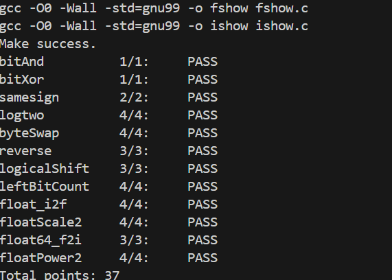

# DataLab 实验报告

姓名：孙溢馨  
学号：2025201705

## 测试结果

| 总分 | bitAnd | bitXor | samesign | logtwo | byteSwap | reverse | logicalShift | leftBitCount | float_i2f | floatScale2 | float64_f2i | floatPower2 |
| --- | --- | --- | --- | --- | --- | --- | --- | --- | --- | --- | --- | --- |
| 37/37 | 1/1 | 1/1 | 2/2 | 4/4 | 4/4 | 3/3 | 3/3 | 4/4 | 4/4 | 4/4 | 3/3 | 4/4 |

运行 `python3 test.py` 后，12 个函数全部通过正确性、合法运算符和最大运算数检查，总分为 37/37。提交前还检查了编译警告和 Git 差异，确保没有调试输出或额外头文件。

## 解题报告

### 亮点

1. `float_i2f`：完整处理符号、规格化、舍入到最近偶数以及尾数进位。
2. `leftBitCount`：使用分段二分定位，避免题目未允许的控制流。
3. `reverse`：使用固定 32 轮移位累积，结构直接且易于验证。

### bitAnd

利用德摩根律把按位与改写为“先分别取反、按位或、再整体取反”。这样只使用 `~` 和 `|`，并保持每一位的真值与 `x & y` 相同。

### bitXor

异或表示“两位不同”。实现分别排除“两位都为 1”和“两位都为 0”的情况，再将两个条件合并，只使用 `~` 与 `&`，并将运算数控制在上限内。

### samesign

先单独处理 0：只有两个参数都为 0 时才算同号；一方为 0 时返回 0。对两个非零数，算术右移 31 位取得符号扩展结果，再用异或判断符号是否不同。

### logtwo

对正整数求以 2 为底的整数对数，本质上是寻找最高有效 1 的位置。依次检查高 16、8、4、2、1 位区间；每确认一段后就右移缩小搜索范围，并把各段位移量合并为最终下标。

### byteSwap

先把字节编号乘 8 得到位移量，提取目标字节。随后构造覆盖两个位置的掩码，将原位置清零，再把两个字节交叉移回，从而不影响其他 24 位。

### reverse

循环 32 次，每轮取出输入最低位，并在结果左移后把该位放到结果最低位。输入同时右移一位，因此原数从低到高的位依次进入结果的高到低位置。循环采用倒计数，避免使用题目未允许的比较运算符。

### logicalShift

直接对有符号数右移可能在高位补 1，因此先进行右移，再构造一个高 `n` 位为 0、其余位为 1 的掩码。与掩码相与即可消除算术右移产生的符号扩展；构造过程也避开了移位 32 位的未定义行为。

### leftBitCount

先对输入取反，把“从左侧连续的 1”转化为“从左侧连续的 0”。然后按 16、8、4、2、1 位分段检查：若当前高段全为 0，就累计该段长度并左移继续搜索。最后额外处理全零情况，使原输入为全 1 时得到 32。

### float_i2f

先记录符号并得到无符号绝对值，再找到最高有效位以确定阶码。最高位不超过第 23 位时直接左移形成尾数；否则右移并检查被舍弃部分。当被舍弃部分超过一半，或恰好一半且保留尾数最低位为 1 时进位，实现 round-to-nearest-even。若进位使尾数溢出，则继续调整阶码。

### floatScale2

先拆分符号、阶码和尾数。NaN 与无穷大的阶码全为 1，直接返回原值；非规格化数通过尾数整体左移实现乘 2，并保留符号；规格化数将阶码加 1。当阶码增长为全 1 时清零尾数，得到对应符号的无穷大。

### float64_f2i

从双精度高 32 位提取符号和 11 位阶码，并减去偏置 1023。负阶码表示绝对值小于 1，向零舍入为 0；阶码大于 30 时返回溢出标记。其余情况拼接双精度尾数的高 30 位，补上隐藏的首位 1，再按阶码对齐并恢复符号。

### floatPower2

按指数范围分三类处理：大于 127 时返回正无穷；`-126` 到 `127` 使用带偏置阶码生成规格化数；`-149` 到 `-127` 在尾数字段设置唯一的 1 生成非规格化数；小于 `-149` 时结果下溢为 0。

## 反馈与收获

本实验最需要小心的不是单个表达式，而是正确性、运算符限制、运算数上限和 C 语言未定义行为必须同时满足。浮点题让我进一步理解了阶码、隐藏位、非规格化数和舍入规则；整数题则强化了用分段搜索和掩码替代常规控制逻辑的能力。

## 参考资料

- 课程仓库中的 DataLab README、函数注释与测试脚本。
- Randal E. Bryant、David R. O'Hallaron，《深入理解计算机系统》第 2 章“信息的表示和处理”。
